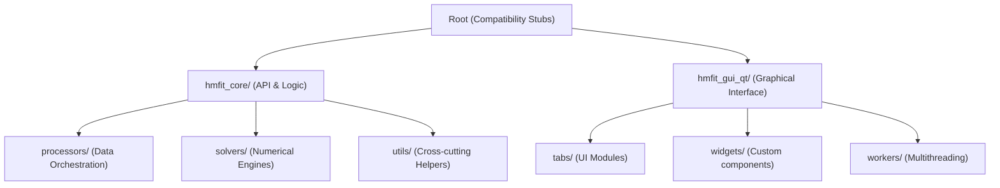

# HMFit Architecture

This document describes the organization of the HMFit project after the refactoring that consolidated the core logic and the PySide6 (Qt) graphical interface.

## Project Structure

### 1. `hmfit_core/` (Scientific Heart)
- **`api.py`**: High-level entry points for fitting tasks.
- **`processors/`**: High-level data handling (Excel loading, Plotly data preparation).
    - `nmr_processor.py`: NMR-specific fitting and report generation.
    - `spectroscopy_processor.py`: Absorption/Spectroscopy fitting and report generation.
- **`solvers/`**: Numerical implementations of mass balance algorithms.
    - `nr_conc.py`: Newton-Raphson solver.
    - `lm_conc.py`: Levenberg-Marquardt solver.
- **`utils/`**: Generic mathematical and system utilities.
    - `np_backend.py`: Abstraction layer for NumPy/JAX.
    - `nnls_utils.py`: Residuals and Non-Negative Least Squares.
    - `errors.py`: Error propagation and metrics (VarPro).

### 2. `hmfit_gui_qt/` (Modern Interface)
- Based on **PySide6**.
- Uses a decoupled **Worker/Thread** pattern (in `workers/`) to keep the UI responsive during heavy calculations.
- Modularized into `tabs/` (NMR, Spectroscopy) and reusable `widgets/`.

## Internal Imports
The project uses **relative imports** within the `hmfit_core` package (e.g., `from ..utils import xp`) to ensure portability and proper packaging support. All high-level modules and scripts should import from the `hmfit_core` sub-packages directly.
